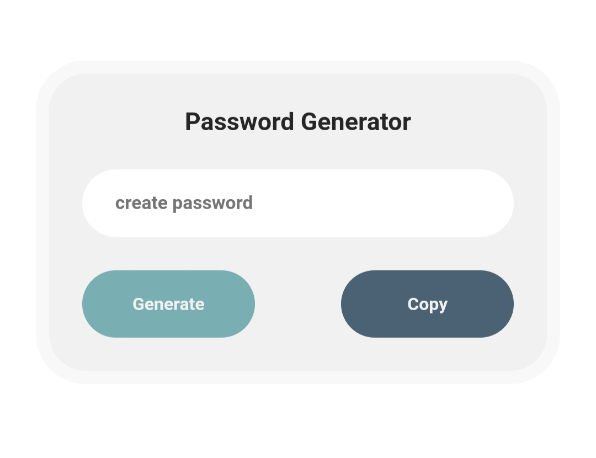

# Beginner Web-development Project - Password Generator

This is a Password Generator

## Table of contents

- [Overview](#overview)
  - [The challenge](#the-challenge)
  - [Screenshot](#screenshot)
  - [Links](#links)
  - [Built with](#built-with)
- [Author](#author)

## Overview
  This beginner project focuses on creating a password generator. With the click of the generate button, it produces a new 12-character random password. The user-friendly interface allows easy password generation and copying.
  
### The challenge
Users should be able to:

- Generate new random passwords
- Copy Password to clipboard
- Clean and simple User interface.

### Screenshot

### Links

- Solution URL: [Add solution URL here](https://sh4vii.github.io/password-generator/)

### Built with

- Semantic HTML5 markup
- CSS custom properties
- Javascrip

## Author

- Name: Shavii

